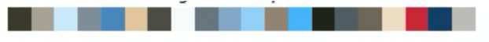
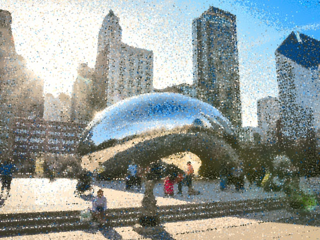

# Creating Pointillistic Art from a given image
### Tech used: Python, OpenCV, Machine Learning, KMeans Clustering, Probability

### About
This was a project inspired by https://hackernoon.com/https-medium-com-matteoronchetti-pointillism-with-python-and-opencv-f4274e6bbb7b

The program takes an input image and converts it into a pointillistic one. 
* Image is downsampled to speed up Kmeans clustering. 
* Kmeans clustering is used to create a color palette
* Vector field of image computed using Scharr Derivative
* Closest color chosen from palette to paint onto base image

### Example Output:

Original Input:  

Computed Color Palette from KMeans clustering:   

Output:  

  

There  more example images in the results folder.